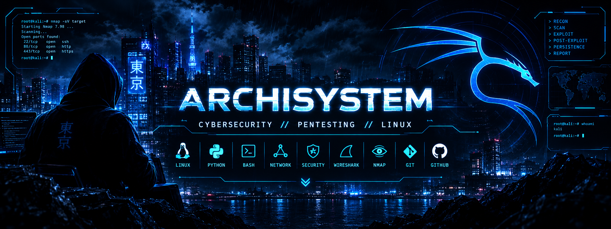

  

⚡ ARCHISYSTEM

CYBERSECURITY  //  PENTESTING  //  LINUX

  
  
  

> whoami

<table>
<tr>
<td width="55%" valign="top">

🧠 PROFILE

USER        : ARTUR
ROLE        : CYBERSECURITY STUDENT
FOCUS       : PENTESTING
PLATFORM    : LINUX
NETWORKING  : CISCO / GNS3
TOOLS       : NMAP / WIRESHARK / GIT

MISSION
────────────────────────────────────
LEARN → PRACTICE → ANALYZE → IMPROVE

</td>
<td width="45%" valign="top">

🎯 CURRENT OBJECTIVE

[■■■■■■■■■■■■■■■■□□]  LEARNING

01  Linux
02  Networking
03  Cisco / GNS3
04  Wireshark
05  Nmap
06  Python / Bash
07  Web Security
08  Pentesting

</td>
</tr>
</table>

> arsenal

🐧 LINUX

🌐 NETWORKING

🔎 SECURITY

💻 DEVELOPMENT

⚙️ WORKFLOW

// CURRENT MISSION

BECOME A PROFESSIONAL SECURITY SPECIALIST

 

LEARN  •  PRACTICE  •  BREAK  •  ANALYZE  •  IMPROVE

 

